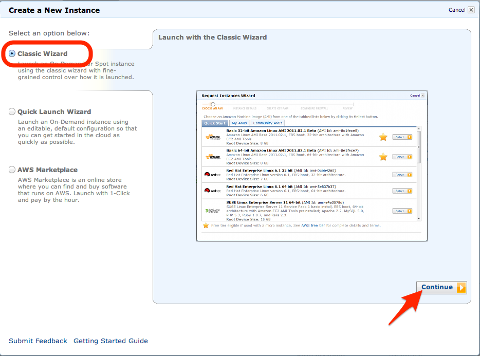
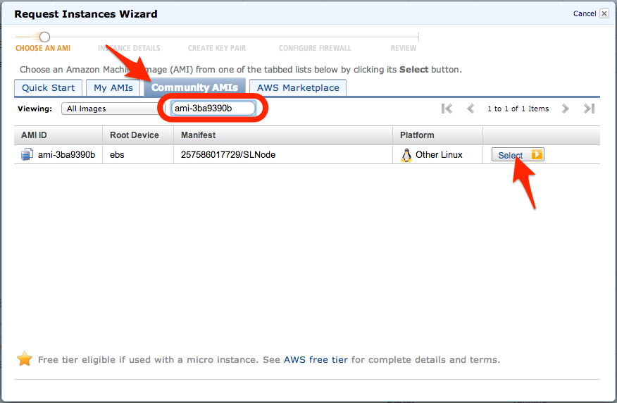
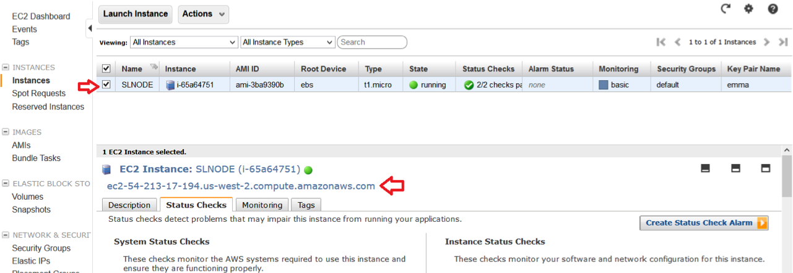

# Getting Started with StrongLoop Node

In this Getting Started guide we are going to start with installing StrongLoop Node then configure and run a sample application -- a blog engine -- to demonstrate how one can build an application using StrongLoop Node.

# The What of StrongLoop Node

StrongLoop Node is a packaged distribution of Node.js, NPM and a set of StrongLoop utilities (not available in the beta release). All of these are installed in global locations, meaning you can use the "node" and "npm" commands from your terminal once you install StrongLoop Node.

# The How of StrongLoop Node

As a packaged distribution of Node.js and NPM, at its core you can consider using StrongLoop Node as you would use Node.js. Therefore, how StrongLoop Node works is effectively identical except that the packages have been tested, certified, and you can get support from StrongLoop if you're using StrongLoop Node.

In this guide we'll get you going with StrongLoop Node and explore a sample blogging application.

# Installing StrongLoop Node

First, [download](http://www.strongloop.com/products#downloads) the StrongLoop Node distribution for your platform.

_For Windows or MacOS X, the installer will guide you through the installation._

_NOTE: On MacOS Mountain Lion, you'll need to right-click or command-click the .pkg file and choose Open or else you'll get a security warning. On Windows, please accept the "Unknown" publisher. The packages will be signed when the 1.0.0 release is out._

**Debian**

For Debian packages, use the following command:

    $ sudo dpkg -i <deb file name>
    
**RPM**

For RPM packages, use the following command:

    $ sudo rpm -i <rpm file name>
    
Once you finish the installation, the `node` command will be available on the `PATH`.

 - **Linux (Deb & RPM)** - /usr/bin
 - **MacOS** - /usr/local/bin
 - **Windows (x64)** - C:\Program Files\StrongLoop Node
 - **Windows (x86)** - C:\Program Files (x86)\StrongLoop Node

## Get the sample blog application

The sample blog application is installed by default at the following locations varied by the platforms.

 - **Linux (Deb & RPM)** - /usr/share/strongloop-node/sample-apps/sample-blog
 - **MacOS** - /usr/local/share/strongloop-node/sample-apps/sampleblog
 - **Windows (x64)** - C:\Program Files\StrongLoop Node\strongloop-sampleapps\sample-blog
 - **Windows (x86)** - C:\Program Files (x86)\StrongLoop

If you are a git user, you can also clone it from the StrongLoop github repository:
    
    $ git clone git://github.com/strongloop/sample-blog.git
    
## Run the sample blog application

The sample blog application uses MongoDB to store blog entries and users. Before you run it, you'll have to install or configure MongoDB.

To install MongoDB, you can follow instructions [here](http://www.mongodb.org/downloads). Version **2.2.3** is recommended.

If you've just installed mongodb you can run it by going to the directory where you installed it and running:

    $ mkdir sample-blog-db
    $ bin/mongod --dbpath sample-blog-db

This creates a data directory called sample-blog-db and tells mongo to start and use that directory. If you already have a mongodb you want to use somewhere, you can edit the connection variables in sample-blog/config/config.js. Now you can start the sample-blog application as follows:

    $ cd sample-blog
    $ npm install (only required if you check out the source code from github)
    $ node app

You should see messages on the console:
    
    Sample blog server listening on port 3000
    MongoDB connection opened

Now try the following links inside your web browser:

 - View all posts -- http://localhost:3000
 - View all posts as JSON -- http://localhost:3000/rest/blogs
 - View all users as JSON -- http://localhost:3000/rest/users
 - Create a new post (username: strongloop, pw: password) -- http://localhost:3000/post

 
Now that we know the application works as intended, let's look at the blog's structure to get an idea of how we arrived at the endpoint.

# Understand the architecture

The blog uses a model-view-controller setup. The following diagram illustrates the building blocks that consist of the application built with StrongLoop Node.

# Walk through the application flow

Let's walk through what's behind the scenes so that you can better understand how all of the pieces work together. The first one is when you the hit [http://localhost:3000](http://localhost:3000) URL.

 1. The browser sends an HTTP GET / request to the StrongLoop Node server.
 1. The Express route for / kicks in, and it invokes the 'index' function as the controller.
 1. The controller calls Mongoose blog model to retrieve all blog entries from MongoDB.
 1. The EJS template for home page is rendered with the data from step 3.
 1. The HTML response is sent back to the browser.

The second flow is more involved. When you hit the 'New Post' button, it will bring up the Blog posting page so that you can create a new blog. Again, there are multiple steps involved within the application.

 1. The browser sends an HTTP GET /post request to the StrongLoop Node server.
 1. The Express authentication handler backed by Passport intercepts the request, as the /post URL is protected.
 1. Since the user hasn't logged in yet, a redirect to the Login page is sent back to the browser.
 1. The browser sends an HTTP GET /login request to StrongLoop Node server.
 1. The Express route for /login kicks in, and it invokes the 'loginForm' function as the controller.
 1. The controller renders the login form from its EJS template. The HTML response is sent back to the browser.
 1. The user types in the user name/password and click on the 'Login'.
 1. The Express route for POST /login calls the passport module which in turn invokes the Mongoose User model to make sure it has a record matching the user name/password. If yes, it redirects the browser back to the blog post page.
 1. Now the user fills in the title/content and click on the 'Save' button.
 1. The browser sends an HTTP POST /post request to StrongLoop Node server.
 1. The Express authentication handler intercepts the request again and it finds out the user is authenticated. It let the request continue to flow to the Express route for POST /post.
 1. The route calls Mongoose blog model to save the newly created blog into MongoDB and send a redirect to / back to the browser.
 1. Now the browser gets the [http://localhost:3000](http://localhost:3000) page as we described in the first flow. Your new post will show up at the top of the page.
 
 
## Build the sample-blog

When you reach this section, we assume that you now have a good understanding of the sample blog application written in Node.js. Are you interested in building your own? Let's go step by step to illustrate how we build the sample-blog application using StrongLoop Node.

### 1. Create a skeleton web application

    $ slnode create web sample-blog -mr

      create : sample-blog/app.js
      create : sample-blog/package.json
      create : sample-blog/public/stylesheets/style.css
      create : sample-blog/routes/index.js
      create : sample-blog/views/index.ejs
      create : sample-blog/db/config.js
      create : sample-blog/db/mongo-store.js
      create : sample-blog/models/user.js
      create : sample-blog/sample-blog
      create : sample-blog/routes/resource.js

    $ cd sample-blog
    $ slnode install

This will create a simple Express based web application. There are several important files to explain:

`package.json` - is the node.js package descriptor. It defines the name, version and dependencies of the application.

`app.js` - is a JavaScript file serving as the main program for sample blog application. It creates a web server and registers Express routes and views.

### 2. Define data models using Mongoose schema

For the blog application, we need a persistent store to keep user data and blog entries. We choose MongoDB (http://www.mongodb.org) and the Mongoose (http://mongoosejs.com) module for node as the persistence layer.

To start, we need to define the blog and user schemas using Mongoose so that we can create, retrieve, update, and delete the corresponding entities easily. For example, user will have properties such as username, password, first name, last name, and email. Blog will have properties such as author, title, content, and comments. See http://mongoosejs.com/docs/guide.html for more information.

There are two models needed for the blog application:

 - models/blog.js
 - models/user.js

<!-- break -->

    var mongoose = require('mongoose');
    var Schema = mongoose.Schema;
    var CommentSchema = new Schema({
        author:{type:String, index: true},
        body:{type:String},
        date:{type:Date, default: new Date()}
    });
    var BlogSchema = new Schema({
        title:{type:String, index: true},
        body:{type:String},
        author:{type:String, index: true},
        date:{type:Date, default: new Date()},
        tags:{type:[String], index: true},
        comments: [CommentSchema]
    });

### 3. Configure and connect to MongoDB

We have covered how to install a new MongoDB database or reuse and existing one in previous sections. To make it easy to make changes, we abstract the MongoDB related configuration into an object inside config/config.js. The relevant snippet is:

    exports.creds = {
      mongo: {
        'hostname': 'localhost',
        'port': 27017,
        'username': '',
        'password': '',
        'db': 'sample-blog_development'
      }
    }

There is also code that reads the configuration and create connection to the given MongoDB database. The file is db/mongo-store.js.

### 4. Expose data services as REST APIs

Now we have the blog model defined. Can we access the blog entries remotely using REST APIs? Yes! With Mongoose and Express, it's actually pretty straightforward.

We use HTTP POST /rest/blogs to create a new blog entry. First, we add new function create as follows:

    /**
     * Create a new entity */
    exports.create = function(mongoose) {
      var mongo = mongoose;
      return function(req, res, next) {
          var mongoModel = mongo.model(req.params.resource);
          if(!mongoModel) {
              next();
              return;
          }
          mongoModel.create(req.body, function (err, obj) {
              if (err) {
                  console.log(err);
                  res.send(500, err);
              }
              else {
                  res.send(200, obj);
              }
          });
      };
    }

Interestingly, the create function can be used to create instances against any defined Mongoose models as it uses the resource name to look up the schema. The body of the HTTP request is the JSON representation of the entity.

Now we need to tell Express that the create function will be used to handle HTTP POST to /rest/:resource URLs. The registration is just one line of code:

    // Create a new entity
    app.post('/rest/:resource', exports.create(mongoose));
   
The corresponding file for our sample application is /routes/resource.js. You can find all CRUD operations are supported:

<table class="standard_table">
  <tbody>
    <tr>
      <td><strong>HTTP Verb</strong></td>
      <td><strong>URL Pattern</strong></td>
      <td><strong>MongoDB Operation</strong></td>
    </tr>
    <tr>
      <td>POST</td>
      <td>/rest/:resource</td>
      <td>Create a new document</td>
    </tr>
    <tr>
      <td>GET</td>
      <td>/rest/:resource?skip=&amp;limit=</td>
      <td>List all documents for the given collection. Optionally, skip and limit
      parameters can be provides from the query string to support pagination</td>
    </tr>
    <tr>
      <td>GET</td>
      <td>/rest/:resource/:id</td>
      <td>Retrieve a document by id</td>
    </tr>
    <tr>
      <td>PUT</td>
      <td>/rest/:resource/:id</td>
      <td>Update a document by id</td>
    </tr>
    <tr>
      <td>DELETE</td>
      <td>/rest/:resource/:id</td>
      <td>Delete a document by id</td>
    </tr>
  </tbody>
</table>

### 5. Enable authentication

On the Internet, certain web pages or APIs need to be protected so that only authorized users can access them. For example, we will secure the REST APIs as well as the blog post page so that only logged in users can create blog posts.

Luckily, with Express and Passport (http://passportjs.org) modules, the job is not difficult. There are a few simple steps to enable authentication.

#### 1. Define a passport strategy so that it knows which authentication mechanism to use. In our case, we use the user collection from the MongoDB. It's defined in routes/auth.js.

    passport.use(new LocalStrategy(function(username, password, done) {
      User.findByUsernamePassword(username, password, function(err, user) {
          if (err) {
              return done(err);
          }
          if (!user) {
              return done(null, false);
          }
          return done(null, user);
      });
    }));

#### 2. We also need to have a few forms/pages to deal with login, logout, and account information. These are modeled as Express views and routes too. See views/account.ejs and views/login.ejs.

#### 3. Glue all the pieces together

    /**
     * Set up the login handler
     */
    exports.setup = function(app) {
      app.use(passport.initialize());
      app.use(passport.session());
      app.all('/post', function(req, res, next) {
          console.log(req.path);
          if (req.path === "/login") {
              next();
          } else {
              ensure.ensureLoggedIn('/login')(req, res, next);
          }
      });
      app.get('/login', exports.loginForm);
      app.post('/login', exports.login);
      app.get('/logout', exports.logout);
      app.get('/account', exports.account);
    };

#### 6. Add test cases

Developing an application cannot go well without test cases. There are various test frameworks for Node.js. We use mocha (http://visionmedia.github.com/mocha) for the sample application. Typically, you can add test cases to /test folder and name them as `*- mocha.js`.

In package.json, create a script so that you can use "npm test" to run the test cases.

    "scripts": {
      "start": "node app",
      "test": "./node_modules/mocha/bin/mocha --timeout 30000 --reporter spec test/*-mocha.js --noAuth"
    }
   
#### 7. Add client-side artifacts

At this point, we pretty much have all the backend code ready for the blog application. If you are comfortable with REST APIs, you can definitely start to use 'curl' scripts to try out the blog functions. It would be nice to have simple UI to list blog entries, add comments, and create new entries.

Here is the list of artifacts we add to provide the UI.

views/index.ejs: The EJS template for index page that lists all blog entries. It take an array of blog entries.
views/post.ejs: The form to post new blog entries.
There are peers of these two views in Express routes:

routes/index.js: Define the functions to list blog entries and update them with new comments.
routes/post.js: Define the functions to render post form and create new blog entries.
The routes also register URLs, such as:

    exports.setup = function(app) {
      app.get('/', exports.index);
      app.post('/postComment', exports.postComment);
    };
    exports.setup = function(app) {
      app.get('/post', exports.post);
      app.post('/post', exports.save);
    };
   
The last piece of the puzzle is static assets, such as HTML files, images, or CSS sheets. We place them under /public and register a static handler with Express in app.js as follows:

    app.use(express.static(path.join(__dirname, 'public')));

#### 8. Run the demo

**Finally, it's demo time!**

    $ cd sample-blog
    $ mkdir sample-blog-db
    $ mongod --dbpath=sample-blog-db
    $ slnode install
    $ node app

Enjoy the blog application at: [http://localhost:3000/](http://localhost:3000/)

## Monitoring your applications with StrongOps

StrongOps provides real-time monitoring for your Node.js application.  We allow
you to gain detailed, real-time performance monitoring of your Node.js
application services so you can see everything that is happening, as it happens.
This includes understanding system usage at every moment in time to uncover and
resolve issues within the application as they arise.

Adding StrongOps support is easy, visit [nodefly](http://nodefly.com) and
register. Once you've registered, visit the [howto
page](http://nodefly.com/#howto), and copy the API key out of section "2. Code",
its a long hexadecimal string.

Insert the following code at the very top of app.js (it must be the first code
run by your app):

    require('strong-agent').profile(
      'xxxxxxxxxxxxxxxxxxxxxxxxxxxxxxxx',
      ['com.strongloop.example.blog']
    );

where the series of 'xx...xx' will be your key.

As a last step, you need to install the strong-agent module, and you will be
ready to run the app:

    $ slnode install --save strong-agent
    $ node app

That's all it takes! Now go back to the nodefly home page, and wait for the
dashboard to appear with live real-time performance data (the dashboard won't be
visible until the app starts to report performance data).

For more information about StrongOps and nodefly, see [[FIXME]].

## Clustering the sample blog application

Clustering the application means using Node's built-in support for running as a
cluster of identical workers,
all listening on the same port. It's possible to use the
[cluster](http://nodejs.org/docs/latest/api/cluster.html)
module directly, but in keeping with the node core design philosophy of
providing fundamental mechanism, the cluster module has very basic functionality. 
Instead, we will use the strong-cluster-control module to both start a cluster,
and also allow run-time management of the cluster from the command line.

Once you start the cluster controller in your app, it automatically maintains a
set number of workers, and listens on a control port so you can reconfigure your
cluster at run-time.

Functionality of the `clusterctl` utility is straight-forward:

- status: worker cluster IDs and process IDs
- set-size: set the number or workers you want in your cluster
- disconnect: disconnect all the workers, causing the controller to start new
  ones
- fork: fork another worker

If you think your node instance are under-utilized, and it makes sense to have
less workers, you can set the size lower without taking your application down.
Or if your node instances are running as hard as they can, and you still have
free CPU you can increase the number of workers.

The cluster-controller might also help you do live upgrades of your workers. If
you have updated the source, and want to restart all your workers, disconnect
them. As they exit, the controller will fork new ones to replace them, which
will be running the new code.

So, lets get started. We are going to add two small blocks of code to the
sample-blog's app.js, that's all it takes. At the very top, after the

    , setup = require('./app-setup.js');

Add the following code:

    if(cluster.isMaster) {
      control.start({
        size: control.CPUS
      });
    } else {

and at the very end of the file, as the very last line, add a single `}`:

    }

to match the `else {` you added above.

As a last step, you need to install the strong-cluster-control module, and you
will be ready to run the app:

    $ slnode install --save strong-cluster-control
    $ node app

The app.js will now run as the cluster master, maintaining the cluster size. We
chose a cluster size according to the number of CPUs you have. This is a good
default, but you should do performance tuning to confirm that this is the right
choice for your application under load.

If you decide that it is not the right choice, you don't have to restart your
app. Lets look at the other aspect of strong-cluster-control, the `clusterctl`
command line interface. In the sample-app directory, run:

    $ ./node_modules/.bin/clusterctl 
    worker count: 2
    worker id 0: { pid: 7696 }
    worker id 1: { pid: 7703 }

Note that we are running the CLI from your locally installed node modules. It
will always be there, but if you would like to install it globally, you can do
this in the standard node way:

    $ slnode install -g strong-cluster-control

Which should install the `clusterctl` utility into your path.

Now, perhaps you decide you want 4 workers, instead of 2, to get better
utilization of your system, try this:

    $ ./node_modules/.bin/clusterctl set-size 4
    $ ./node_modules/.bin/clusterctl status
    worker count: 4
    worker id 0: { pid: 7696 }
    worker id 1: { pid: 7703 }
    worker id 2: { pid: 7705 }
    worker id 3: { pid: 7707 }

For more information on the strong-cluster-control modules, see the
[[FIXME strong-cluster-control blog]],
or check out the API and CLI documentation on
[github](http://github.com/strongloop/strong-cluster-control).

## Interacting with StrongLoop Node over the command line (slnode)

`slnode` is a command line tool that ships with StrongLoop Node for building and managing applications. It's a Swiss-Army knife tool that provides commands for scaffolding, testing and running Node.js source code.

**`slnode` offers a list of subcommands:**

 - **create**: initialize a new StrongLoop Node project, and create boilerplate for modules and packages
 - **run**: run a specified script
 - **npm**: run a specified npm command
 - **env**: print node environment information
 - **install**: install a package from the StrongLoop Node npm repository and/or community repository
 - **test**: run tests
 - **version**: print the version of StrongLoop Node
 
## Creating applications

The `create` command supports a few program types. The web type is used by default and when generated includes the following:

 - **package.json** - dependencies and other package configuration
 - **app.js** - app entry point and runtime configuration
 - **public** - for holding static assets (images, css, et al)
 - **routes** - route handler functions
 - **views** - templates for rendering html

You can create a simple web application with just a single command:

    $ slnode create web my-app

Run the newly created app with the following commands.

    $ cd my-app
    $ slnode run app.js

## Creating boilerplate for modules

The create command also makes it easy to create boilerplate code for a new module you can then publish to npm or simply `require` in your application. You can do this by executing:

    $ slnode create module my-module
    
This command also supports automatically generating tests:

    $ slnode create module my-module --test

and allows you to supply a stream type to implement:

    $ slnode create module my-module --stream transform

For more information see the help for each command:

    $ slnode create -h
    $ slnode create module -h

## Running node scripts

You can run node scripts with slnode:

    $ slnode [run] [script] [script-args]

For example,

    $ slnode app.js
    $ slnode run app
    $ slnode app.js -a info

## Running npm commands

For your convenience, slnode also supports npm commands as follows:

    $ slnode [npm] <npm-command> [npm-command-args]

Please note that npm is optional if the npm-command name doesn't conflict with other slnode commands or scripts.

For example,

    $ slnode install -f
    $ slnode ls
    $ slnode npm rm express

The commonly used commands are:

 - **[install](https://npmjs.org/doc/install.html)** Install a package
 - **[link](https://npmjs.org/doc/link.html)** Symlink a package folder
 - **[ls/list](https://npmjs.org/doc/list.html)** List installed packages
 - **[outdated](https://npmjs.org/doc/outdated.html)** Check for outdated packages
 - **[prune](https://npmjs.org/doc/prune.html)** Remove extraneous packages
 - **[rebuild](https://npmjs.org/doc/rebuild.html)** Rebuild a package
 - **[dedupe](https://npmjs.org/doc/dedupe.html)** Reduce duplication
 - **[rm/uninstall](https://npmjs.org/doc/rm.html)** Remove a package
 - **[update](https://npmjs.org/doc/update.html)** Update a package
 - **[shrinkwrap](https://npmjs.org/doc/shrinkwrap.html)** Lock down dependency versions
 - **[run-script](https://npmjs.org/doc/run-script.html)** Run arbitrary package scripts
 - **[start](https://npmjs.org/doc/start.html)** Start a package
 - **[stop](https://npmjs.org/doc/stop.html)** Stop a package
 - **[restart](https://npmjs.org/doc/restart.html)** Start a package
 - **[test](https://npmjs.org/doc/test.html)** Test a package 

# Debugging node applications

In this guide we are going to debug the sample blog application that comes as
a part of StrongLoop Node distribution. See
[Building a blog engine](http://strongloop.com/products/resources#?t=building-a-blog-engine)
for instructions on setting up the application.

## Running the debugger

The blog application is started by the following command:

    $ node app.js

You can run the application in a debugger as follows:

    $ slnode debug app.js

The command will do three steps under the hood:

  1. Start the application in debug mode.
  2. Start node-inspector - a debugger with HTML-based GUI.
  3. Open node-inspector page in your default browser.

Here is a screenshot of a node-inspector page in Chrome:

</img>

**NOTE:** node-inspector works only in Chrome browser at the moment. If you
are using a different browser, you will have to reopen node-inspector page
in Chrome.

## Working with node-inspector

Now it's the time to set a breakpoint and inspect what's going on under the
hood of our blog application.

Click on the "Show navigator" icon in the upper-left corner to see a tree-list
of all blog source files. Expand "routes" folder and double-click on
"index.js". Click on line number 29 to set a breakpoint at the
beginning of `postComment` function.

You should get a screen like this:

</img>

Open the blog application in a new tab and submit a comment. You can see that
the page is waiting for the server to respond. This is because
the server process is paused on our breakpoint.

Switch to node-inspector's tab in the browser to inspect the fields of the
incomming http request. Leave your mouse over a variable or a property
to see it's value.

</img>

You can step through javascript statements by pressing F10. Use F8 to resume
script execution after you are done.

Check out [Chrome Developer Tools Guide](https://developers.google.com/chrome-developer-tools/docs/javascript-debugging)
for a walkthrough of other debugger features. (Remember that node-inspector
is based on Chrome Developer Tools and most features work exactly the same.)

# Private NPM registry

Any team building private source, non-trivial Node.js applications soon
realizes the need for a private NPM registry. Here is short guide on how to
configure one yourself.

## Setup the server

The first step is to setup a Reggie instance which will act as your npm
registry.

1. Prepare a server machine for the registry. The machine should be accessible
by all team members and has node.js installed.

2. Install Reggie as a global application

        $ npm install -g reggie

3. Create a directory where Reggie will store all packages and other run-time
data.

        $ mkdir ~/reggie-data

4. Start the Reggie server (at the default port 8080)

        $ reggie-server -d ~/reggie-data

  You might want to extend your `init.d` scripts so that the Reggie server
  is automatically started after reboots.

  Check [Reggie's manual](https://github.com/mbrevoort/node-reggie/blob/master/README.md#start-up-options)
  on how to change the default port and other settings.

## Publishing packages

First install the reggie CLI client on your development machine:

    $ npm install -g reggie

Then you can publish a package to your private registry using the `publish`
command:

    $ reggie -u http://{reggie-host}:8080/ publish

## Specifying package dependencies

The npm client does not support multiple registries (yet), but fortunatelly
it can download packages from any URL.

Use the following command to install a 1.0.0 version of a private package named
'private-helpers':

    $ npm install --save http://{reggie-host}:8080/package/private-helpers/1.0.0

This will also add a dependency entry into your `package.json` file:

    dependencies: {
      "private-helpers": "http://{reggie-host}:8080/package/private-helpers/1.0.0"
    }

Reggie supports version wildcards too, consult
[the manual](https://github.com/mbrevoort/node-reggie/blob/master/README.md#resolving-packages-from-reggie)
for description of wildcard version URLs.

# Amazon EC2

StrongLoop provides Amazon Machine Images (AMIs) with pre-installed StrongLoop
Node distribution to simplify the deployment of node applications to
AWS EC2.

## Booting up a new AWS EC2 instance

1. Log into your Amazon AWS account at [http://aws.amazon.com/](http://aws.amazon.com/)

2. Go to My Account/Console &gt; AWS Management Console &gt; EC2.

3. Choose to "Launch Instance" from EC2 Dashboard &gt; INSTANCES &gt;
Instances.

4. Create a new instance using the Classic Wizard.

  

5. Choose "Community AMIs" and search for AMI ID: `ami-3ba9390b` (SLNode 1.0.2)

  

6. Create a key pair for secure connections or choose an existing one.

7. A new instance will be created and listed under EC2 Dashboard &gt;
INSTANCES &gt; Instances

  

## Connecting to the instance

You can use `ssh` to log into the AWS instance.  The host name can be
found in instance details (see the second arrow in the screenshot above).

Example:

    $ ssh ec2-user@ec2-54-213-17-194.us-west-2.compute.amazonaws.com

